# Práctica 2 · Despliegue de Software

API REST de productos (CRUD básico en memoria) contenerizada con Docker y desplegada en Kubernetes local.

## Integrantes
- _Nombre completo 1_
- _Nombre completo 2_
- _Nombre completo 3_

## Tecnología
- Node.js 20 + Express
- Docker Desktop (con Kubernetes habilitado)
- Pruebas con Postman o `curl`

## Video
_Enlace a YouTube: pendiente_

## Endpoints
| Método | Ruta | Descripción |
|---|---|---|
| GET | `/productos` | Lista productos |
| GET | `/productos/:id` | Obtiene un producto |
| POST | `/productos` | Crea un producto. Body JSON: `{"nombre": "Lapiz", "precio": 1500}` |
| DELETE | `/productos/:id` | Elimina un producto |

## Puertos
| Entorno | Puerto host | Puerto contenedor |
|---|---|---|
| Docker | 8080 | 3000 |
| Kubernetes (NodePort) | 30080 | 3000 |

## Parte 1 · Docker
```bash
docker build -t practica2-api:v1 .
docker images
docker run -d -p 8080:3000 --name practica2-api practica2-api:v1
docker ps
```
```powershell
curl.exe -X POST http://localhost:8080/productos -H "Content-Type: application/json" -d '{"nombre":"Lapiz","precio":1500}'
curl.exe http://localhost:8080/productos
curl.exe http://localhost:8080/productos/1
curl.exe -X DELETE http://localhost:8080/productos/1
```
Probar (bash/Linux/macOS):
```bash
curl -X POST http://localhost:8080/productos -H "Content-Type: application/json" -d '{"nombre":"Lapiz","precio":1500}'
curl http://localhost:8080/productos
curl http://localhost:8080/productos/1
curl -X DELETE http://localhost:8080/productos/1
```
Eliminar el contenedor:
```bash
docker rm -f practica2-api
```

## Parte 2 · Kubernetes
Requiere Kubernetes habilitado en Docker Desktop (Settings → Kubernetes → Enable Kubernetes). Usa la imagen local `practica2-api:v1` construida en la parte 1.

```bash
kubectl apply -f k8s/namespace.yaml
kubectl apply -f k8s/deployment.yaml
kubectl apply -f k8s/service.yaml
kubectl get pods -n practica2
kubectl get svc -n practica2
```
Probar (PowerShell):
```powershell
curl.exe -X POST http://localhost:30080/productos -H "Content-Type: application/json" -d '{"nombre":"Lapiz","precio":1500}'
curl.exe http://localhost:30080/productos
curl.exe http://localhost:30080/productos/1
curl.exe -X DELETE http://localhost:30080/productos/1
```
Probar (bash/Linux/macOS):
```bash
curl -X POST http://localhost:30080/productos -H "Content-Type: application/json" -d '{"nombre":"Lapiz","precio":1500}'
curl http://localhost:30080/productos
curl http://localhost:30080/productos/1
curl -X DELETE http://localhost:30080/productos/1
```
Alternativa con port-forward: `kubectl port-forward svc/practica2-api 8081:3000 -n practica2` y usar `http://localhost:8081`.

Eliminar todo: `kubectl delete namespace practica2`

## Buenas prácticas aplicadas
- Namespace propio `practica2`.
- `requests` y `limits` de CPU/memoria en el contenedor.
- Imagen versionada `practica2-api:v1` con `imagePullPolicy: IfNotPresent`.

## Evidencias

### Docker
| Evidencia | Captura |
|---|---|
| Contenedor ejecutándose en Docker Desktop | 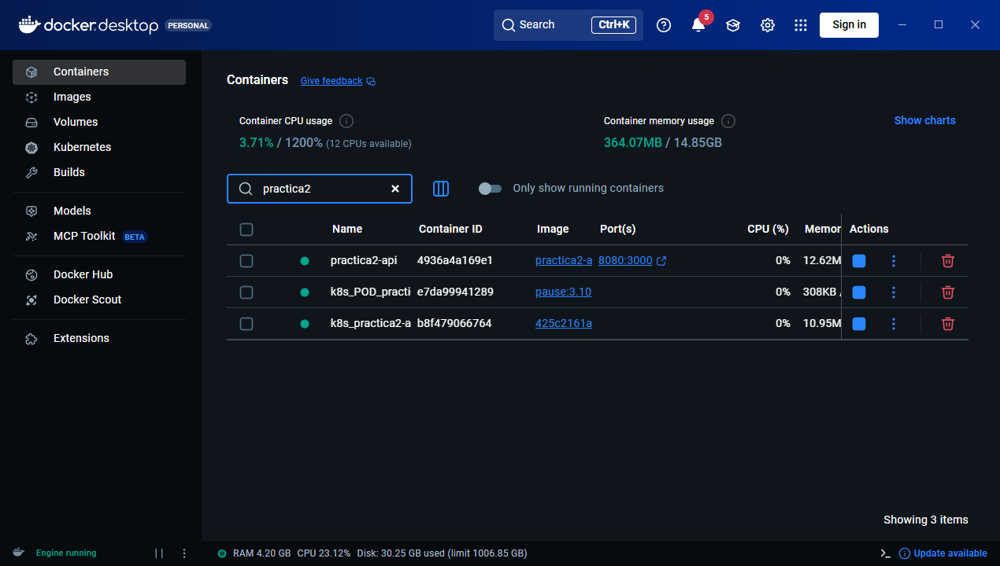 |
| Imagen generada (Docker Desktop) | 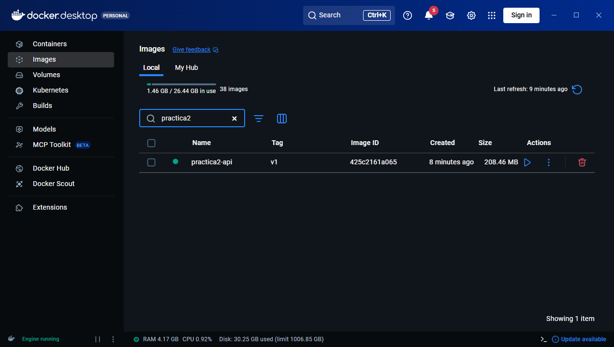 |
| `docker build` | 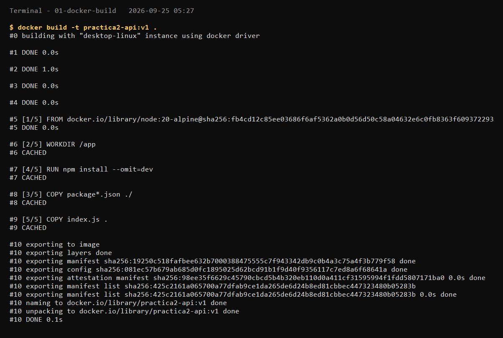 |
| `docker images` | 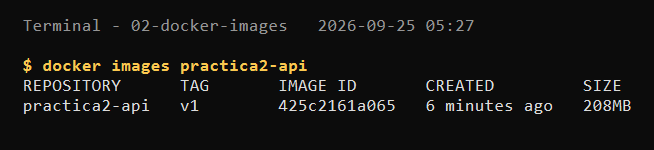 |
| `docker run` / `docker ps` | 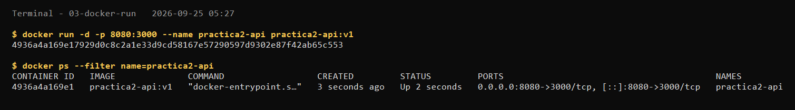 |
| Acceso funcional a la API (puerto 8080) | 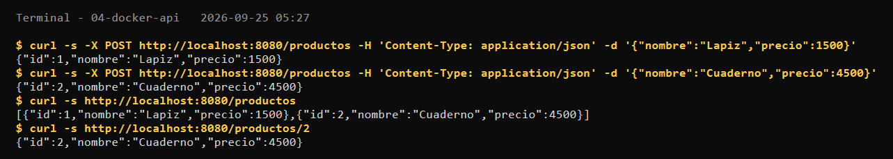 |

### Kubernetes
| Evidencia | Captura |
|---|---|
| `kubectl apply` | 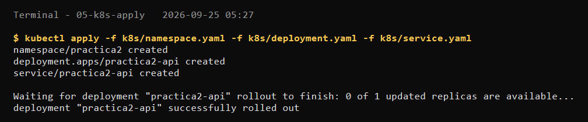 |
| `kubectl get pods -n practica2` | 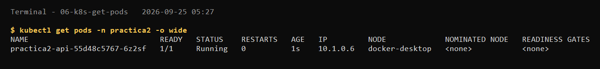 |
| `kubectl get svc -n practica2` | 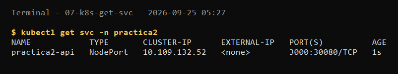 |
| Acceso funcional a la API (NodePort 30080) | 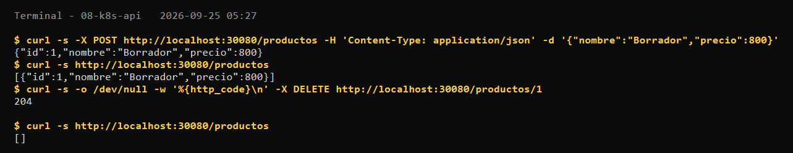 |
| Manifiestos YAML | 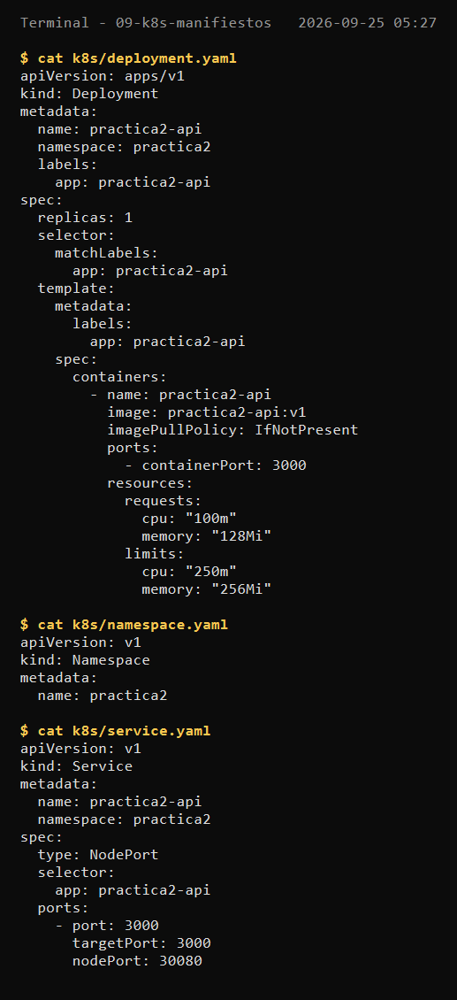 |

## Estructura
```
index.js         Código de la API
package.json     Dependencias
Dockerfile       Construcción de la imagen
k8s/             Manifiestos (namespace, deployment, service)
evidencias/      Capturas de pantalla
REFLEXION.md     Reflexión técnica
```
